Project 5: Comparison of K-Means and LCA Clustering
================
2/20/2022

*Xiao Ma(xm2276), Yida Wang(yw3774), Ruiqi Yan(ry2417), Hao
Zheng(hz2770), Peilin Zhou(pz2281)*

## Introduction

***Objectives***  
Clustering, also known as unsupervised classification, by grouping data
with similar properties, has been broadly used as an independent tool to
obtain intuitive understanding of relevant aspects of a dataset and a
preprocessing step for other algorithms. Well-performed clustering
methods should produce clusters with low inter-class and high
intra-class similarity. Among various methods, K-Means and Latent Class
Analysis (LCA) have been time-tested tools used for normally or
elliptically distributed data, however, their performances in data with
non-normal features are somewhat less understood. To evaluate their
power for non-normal data, this project primarily focuses on comparing
their clustering results by simulation with different scenarios in which
data are skewed or heavy-tailed in bivariate case.  

***Statistical Methods to Be Studied***  
**K-Means** Categorized as a partitioning algorithm, k-means aims to
partition n observations into a set of k clusters where the total
within-cluster variances are minimized. The algorithm starts with a
prespecified number of clusters (k) and places the centroids of the
clusters at some random locations. Then, each data point is assigned to
its closest centroid with the least squared Euclidean distance. The next
step is to update the centroid of the cluster by averaging the data
points assigned to that cluster. Steps of assigning points to the
closest centroid and updating the centroid are repeated until no further
assignments can be performed.  

**Latent Class Analysis** Unlike K-means which uses mean and distances
to classify observations into groups, LCA is based on similarity in data
patterns using probability and it belongs to the mixture models family
which recovers hidden groups from observed data (Ferguson, et al, 2019).
In our project, we consider the case where the observed variable is
continuous. As a model-based method, LCA estimates parameters that best
characterize different distributions and seeks to assign probability
that each observation is a sample from the distribution of a class is
assigned. Retention of fitted models with different classes can be
decided by using criteria such as BIC (Masyn, 2013).  

## Data Generating Methods

In order to conduct the comparison between the above two statistical
methods, we first need to generate non-normal bivariate data since real
life data often has the unnormal feature. Here, we consider the
bivariate distribution as a combination of a marginal distribution and a
conditional distribution, then we can transform the problem into
generating two univariate distributions. Next, focus on four other
common characteristics including kurtosis, skewness, multimodality and
outliers. During the data generation process, we realized that the
outliers can be obtained by creating tails, that is changing the
kurtosis of the distribution. And for multimodality, we combine it into
the data by shifting the distribution to generate different clusters.
Therefore, our main focus becomes simulating bivariate distributions
with different kurtosis and skewness. To compare the performance of
K-Means and LCA under different scenarios, we decide to visualize the
performance measure by changing the kurtosis and skewness parameters
respectively.  
To change the kurtosis, we first induce an algorithm to generate data
from a mixture univariate distribution that combines a student-t
distribution with probability p and a standard normal distribution with
probability (1 - p). Here, let the degree of freedom be 2 to obtain a
heavy tail. We use this algorithm to generate one univariate sample.
Based on the univariate data, we generate the other sample with the
conditional distribution by adding a correlation factor *ρ*. The
conditional distribution of the second variable is the same mixture
distribution but the mean and the variance of the normal distribution
depend on a function of the first variable and rho. Combine these two
samples together, we get the bivariate data. Considering p as the
kurtosis parameter and with its value increasing, the tails become
heavier.  
Next, to change the skewness, we use the skew normal distribution as the
distribution to generate the univariate sample instead. The density
function of skew normal distribution is
*f*(*x*) = 2 × *ϕ*(*x*) × *ψ*(*α**x*), where *ϕ* and *ψ* are the pdf and
cdf of the standard Normal distribution respectively, and parameter
alpha is the skewness coefficient. Then we write a function called
rsnorm using accept/reject algorithm *f*(*x*) &lt; *M**g*(*x*) with
*g*(*x*) being the standard normal distribution, *M* = 2. Using rsnorm
to generate an univariate sample and the bivariate sample by conditional
distribution similar as in the kurtosis case. For both cases, we use
multinomial distribution with k = 3 and p = 0.25, 0.35 and 0.4
respectively to decide the cluster of each sample and shift its mean
based on the cluster. Then, we get bivariate data that have three
clusters with different means for further testing on the classification
methods.  

## Simulation Settings

The simulating scenarios depend on sample size, kurtosis parameters p
and skewness parameter alpha. Sample size is taken as 300, 900 and 1500.
The kurtosis parameter *p* can take any values in \[0, 1\] and we use
every 0.1 unit change in p combined with the change of sample size.
alpha can be any real number. Here, we use alpha within the range \[-10,
10\] for every 2 unit changes and combine with the change of sample
size. We explore the change of sample size combined with various
kurtosis and skewness separately.  

## Selection of Performance Measures

***Adjusted Random Index*** (ARI) When we have the true clustering
assignment of the data, the similarity of true clusters and estimated
clusters could determine the performance of the clustering. Random Index
is one of the external criteria that assesses the agreement between two
clustering assignments. It calculates the percentage of pairs that are
in the same cluster in both clusterings and pairs that are in the
different clusters in both clusterings among the total number of pairs
of the data. The adjusted random index corrects the random index by
considering the chance of random guess. Random Index is bounded between
0 and 1 and ARI closer to 1 usually implies higher similarity. 

***Misclassification Rate*** (MR) The other performance measure is the
misclassification rate that is commonly used in classification.
Classification has defined response, but clustering is unsupervised
learning, so we could not directly measure the error rate. We compute
the misclassification rate with each permutation of the estimated
clusters. The permutation with the lowest misclassification rate should
be the actual estimated clustering and then we could figure out the
actual misclassification rate.  

For each simulation scenario, we run the simulation a hundred times and
calculate the summary statistics of each measure of performance,
especially the average and standard deviation. We also add up the square
of average value from the best performance value with the variance as
the mean square error (MSE) of the performance measure of the
scenario.  

## Simulation Results

### **Data Visualization**

### ***True cluster***

We make some simulation examples with *p* = 0, 0.5, 1 and alpha
 =  − 10, 0, 10 to visualize change of kurtosis and skewness of the
data. We utilize the scatter plot to visualize the data. The series of
scatter plots shows the data for each pair of variables with different
kurtosis and skewness results in different clusters shown in different
colors. Data is concentrated into three clusters after shifting.
Marginal density reflects the distribution of each data which is
multimodial. The unsmooth contour line indicates the data is non-normal,
non-ellipse, and satisfied the requirement of our research. When
kurtosis parameter p = 0 (Fig 1), the plot reflects a flatter top with
fat tails. Clusters are well separated, data share high similarities in
each cluster but are different from other clusters. There is no outlier.
When kurtosis parameter p = 0.5 (Fig 2), data are not well separated and
there are three extreme outlier with heavier tails. When kurtosis
parameter p = 1 (Fig 3), there are more outliers and heavier tails than
p = 0.5. As the kurtosis parameter p gets larger, the value of kurtosis
becomes larger. The data tend to have heavier tails and more outliers.
The similarities among different clusters get higher and the similarity
of each point in a cluster gets lower (Fig 4). Therefore, data becomes
more scattered. As for the skewness, when the skewness parameter alpha =
0 (Fig 5), the three clusters are overlapped, the points are
concentrated but evenly distributed within the cluster. When skewness
parameter alpha = 10 (Fig 6), three clusters are well separated, each
cluster having higher density in the left part. When skewness parameter
alpha  =  − 10 (Fig 7), similar to the plot when alpha = 10, but the
data concentrated in the right part of each cluster due to the change
sign of parameter alpha. When the skewness parameter moves away from 0,
points would be concentrated in some part within the cluster instead of
evenly distributed.  

### ***Estimated cluster***

To have some senses about how the clustering methods work in variation
of p and alpha, we apply the clustering on the data from simulation
examples generated previously, and draw a series of scatter plots. The
plots show the clusters estimated by K-Means and LCA with variation of p
(fig 4) and alpha (fig 8). From the Fig 4, we can figure out that both
two methods divide points into 3 clusters but LCA does not cluster the
data well when p is equal to 1.  
In the figure 8 showing the change in skewness, both clustering methods
have roughly similar results compared with the true clusters.  

### ***Comparison***

In order to compare the performance between LCA and K-Means, we consider
the misclassification rate (MR) and adjusted random index (ARI) of the
two clustering methods LCA and K-Means by comparing the mean, standard
deviation and MSE in different kurtosis and skewness. After obtaining
the performance measures in different scenario, we plot those
performance over the change in kurtosis and skewness respectively to
visualize the outcomes and do the comparison in different sample sizes
300, 900 and 1500 by drawing a grid of plots.  
The trend of ARI and MR of the two methods is very similar. Regardless
of the performance measures, we can see in this figure (fig 9) that when
kurtosis parameter is below 0.5 (light-tails), LCA has better
performance, but when kurtosis increases, the performance of LCA getting
worse and it is worse than that of K-Means when kurtosis parameter is
higher than 0.5 (heavy tail). However, K-means always has higher
variability than LCA, which might be not preferable when we need precise
outcome. The LCA showed higher MSE when kurtosis is high so we might
prefer K-Means for heavy tail data.  

In the figure 10 about the change in skewness, we can observe that when
the skewness parameter is below zero (left-skewed), the mean performance
of LCA is obviously better than K-Means. When the skewness is close to
zero, the performances of these two methods are becoming closer and
maintain this trend for the situation of skewness parameter larger than
zero (right-skewed). LCA always has lower variance than K-Means and has
better average performance in most of the cases.  

Besides, we can figure out that the performance of LCA and K-Means have
similar trends in different sample size 300, 900, 1500.  

## Conclusion

To evaluate the performance of K-Means and LCA for data with non-normal
features which mimics real-world situations, bivariate data with varied
skewness and tail behavior are generated using combination of
distributions and sampling method such as acceptance/rejection
algorithm. With known true cluster assignments from the data generation
process, the clustering results of K-Means and LCA are evaluated by two
criteria, Adjusted Random Index (ARI) and misclassification rate. Based
on the simulation results with varied sample size and parameter values
for skewness and kurtosis, we observe that, regardless of variation in
sample size, as data becomes heavy-tailed or contains large quantity of
outliers, the performance of K-Means is relatively more stable and
better than LCA with higher average ARI score and similar
misclassification rate. In terms of skewness, when data is highly
right-skewed, LCA outperforms K-Means under both criteria. In the
right-skewed situation, two methods show equally desired performance. In
both scenarios, K-Means always has higher variability than LCA, so we
might prefer LCA when we need precise outcomes. It is also worthy to
address that the performance of both methods are more prone to be
influenced or relatively poorer in heavy-tails/outliers situations than
the skewed case.  
Limitation of our work includes but not limited to the fact that as only
bivariate data is considered for evaluation, clustering results of both
methods would likely to be different in more complex cases for data with
non-normal features. To conclude, our work has shown that the
performance of K-Means is more stable to the variations of data
characteristics including sample size, skewness, and kurtosis. Compared
to K-Means, when data is heavily right-skewed, LCA would be a preferable
tool for clustering, whereas when data contains heavy-tails/outliers,
K-means is recommended.  

## Contribution

Xiao Ma is responsible for data generating methods and true cluster
visualization group working with Hao. Generating the data, regulating
the skewness and kurtosis then shifting to check the changes. Did the
corresponding part for the report and presentation. Yida Wang writes the
code of LCA and K-Means performance visualization in the simulation part
based on Ruiqi’s work and response for the sample clustering outputs and
performance plots of report and slide. Ruiqi Yan writes the rsnorm
function for generating skew normal data, find estimated cluster
function to find the actual estimated clusters, compare function to
calculate the performance measure, the for loop to do simulation in each
scenario and writes selection the performance measure part in the
report. Hao Zheng is responsible for the data generating including the
univariate, conditional distribution, adjusting the kurtosis and
skewness, initial visualization, simulation settings and corresponding
report with Xiao. Peilin Zhou is responsible for objectives, statistical
methods to be studied, conclusion of the report, and visualization of
the sample clustering outputs of the two methods based on generated data
in r.

## References

1.  Ferguson, S. L., G. Moore, E. W., & Hull, D. M. (2019). Finding
    latent groups in observed data: A Primer on Latent Profile Analysis
    in mplus for applied researchers. International Journal of
    Behavioral Development, 44(5), 458–468.
    <a href="https://doi.org/10.1177/0165025419881721\" class="uri">https://doi.org/10.1177/0165025419881721\</a>
2.  Masyn, K. E. (2013). Latent class analysis and finite mixture
    modeling. In T. Little (Eds), The Oxford Handbook of Quantitative
    Methods (551-611). New York, NY: Oxford University Press.  

# Appendix I Figures and Tables

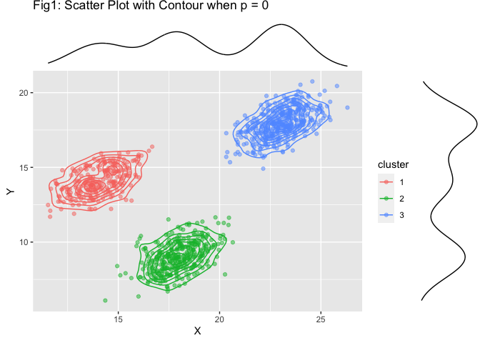<!-- -->

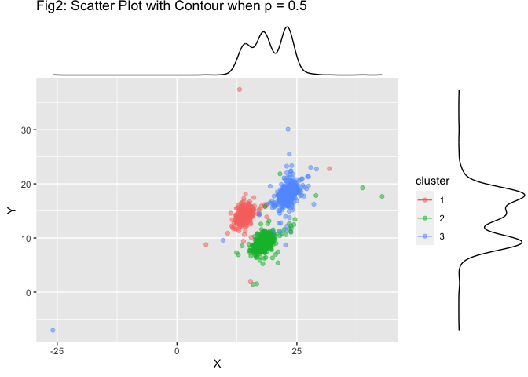<!-- -->

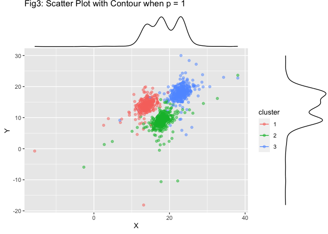<!-- -->

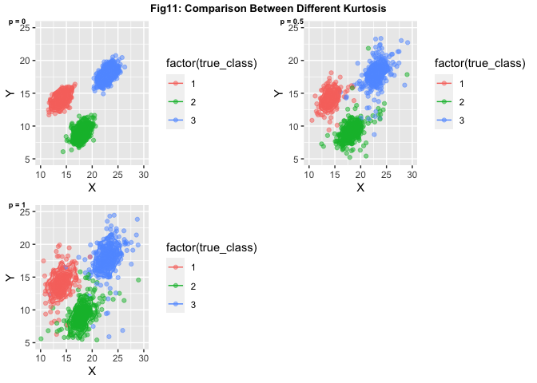<!-- -->

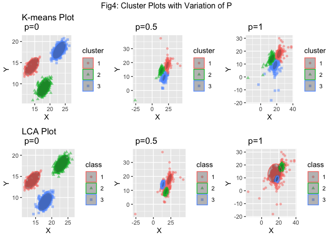<!-- -->

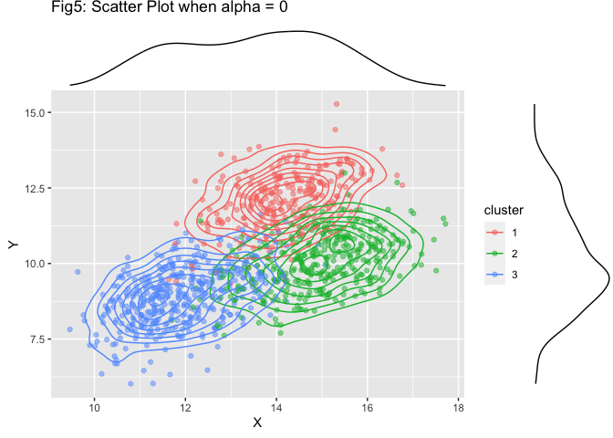<!-- -->

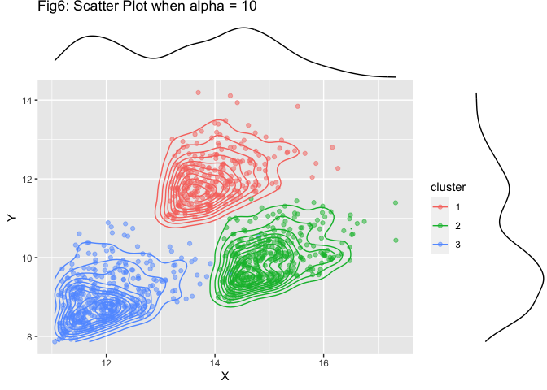<!-- -->

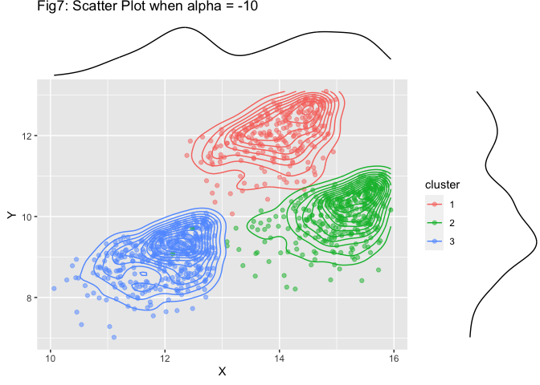<!-- -->

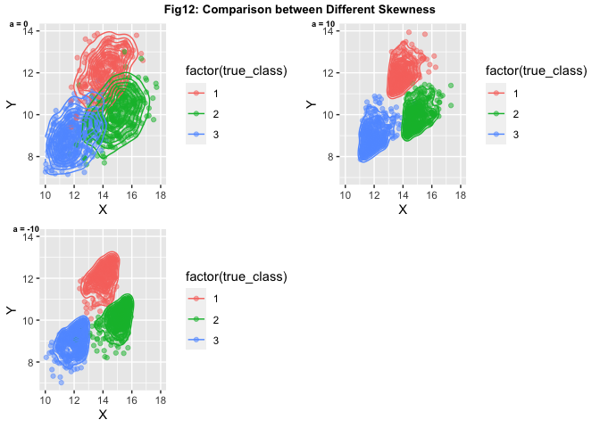<!-- -->

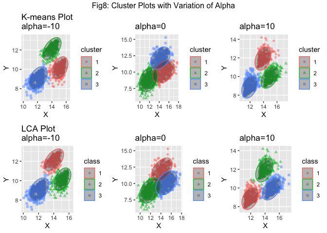<!-- -->

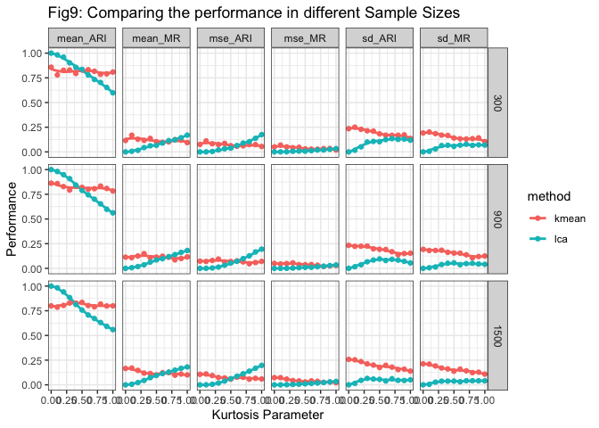<!-- -->

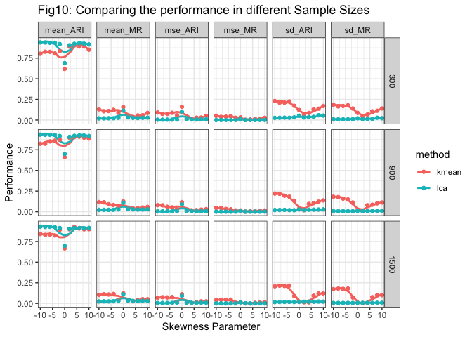<!-- -->

# Appendix II R code

``` r
## Kurtosis

kurdata <- function(N, mu1, s1, mu2, s2, rho, p){
  true_cluster = rmultinom(n = N, size = 1, prob = c(0.25,0.35,0.4))
  
  usenorm <- runif(N) < (1-p)
  X <- usenorm*rnorm(N, mean = mu1, sd = s1) + (1-usenorm)*(rt(N, df = 2)+mu1)
  con_muy = mu2+rho*s2*(X-mu1)/s1
  con_sigmay = sqrt(1-rho^2)*s2
  usenorm <- runif(N) < (1-p)
  Y <- usenorm*rnorm(N, mean = con_muy, sd = con_sigmay) + (1-usenorm)*(rt(N, df = 2)+con_muy)
  
  kurxy = as.data.frame(cbind(X,Y))
  
  # shifting data
  data_mod = kurxy %>% mutate(true_class =
                      true_cluster[1,]*1+true_cluster[2,]*2+true_cluster[3,]*3,
                   X = case_when(true_class == 1 ~ X+14,
                                 true_class == 2 ~ X+18,
                                 true_class == 3 ~ X+23),
                   Y = case_when(true_class == 1 ~ Y+14,
                                 true_class == 2 ~ Y+9,
                                 true_class == 3 ~ Y+18))
  return(data_mod)
}

######
## skewed normal distribution, use alpha to change the skewness of the distribution
rsnorm <-function(N, mu, sigma, alpha){
  mu_diff = mu - alpha*sqrt(2/pi)/sqrt(1+alpha^2)
  x = NULL
  while (length(x)<N){
   g = rnorm(N)
   x = c(x,g[runif(N) < pnorm(alpha*g)])
   }
  return((x[1:N]+mu_diff)*sigma)
}

skewdata <- function(N, mu1, s1, mu2, s2, rho, alpha){
  true_cluster = rmultinom(n = N, size = 1, prob = c(0.25,0.35,0.4))
  
  X = rsnorm(N, mu1, s1, alpha)
  Y = rsnorm(N, mu2 + (s2/s1)*rho*(X - mu1), sqrt((1-rho^2)*s2^2), alpha)
  skewxy = as.data.frame(cbind(X,Y))
  data_mod = skewxy %>% mutate(true_class =
                      true_cluster[1,]*1+true_cluster[2,]*2+true_cluster[3,]*3,
                   X = case_when(true_class == 1 ~ X+14,
                                 true_class == 2 ~ X+15,
                                 true_class == 3 ~ X+12),
                   Y = case_when(true_class == 1 ~ Y+12,
                                 true_class == 2 ~ Y+10,
                                 true_class == 3 ~ Y+9))
  return(data_mod)
}


#Find the permutation of cluster with lowest MR
find_true_estimate_class <- function(true_class, estimate_class){
  per_df = data_frame(per1 = estimate_class,
                     per2 = case_when(
                       estimate_class == 1 ~ 1,
                       estimate_class == 2 ~ 3,
                       estimate_class == 3 ~ 2
                     ),
                     per3 = case_when(
                       estimate_class == 1 ~ 2,
                       estimate_class == 2 ~ 1,
                       estimate_class == 3 ~ 3,
                     ),
                     per4 = case_when(
                       estimate_class == 1 ~ 2,
                       estimate_class == 2 ~ 3,
                       estimate_class == 3 ~ 1
                     ),
                     per5 = case_when(
                       estimate_class == 1 ~ 3,
                       estimate_class == 2 ~ 1,
                       estimate_class == 3 ~ 2
                     ),
                     per6 = case_when(
                       estimate_class == 1 ~ 3,
                       estimate_class == 2 ~ 2,
                       estimate_class == 3 ~ 1
                     )) %>% as.matrix()
   return(per_df[,which.max(colMeans(per_df == true_class))])
}

#Compare two clustering methods using simulated data
compare <- function(N, data_mod, p){
  kmean_mod = kmeans(data_mod[,-3], 3)
  mclust_mod = Mclust(data_mod[,-3], G = 3, verbose = FALSE)
  ARI_kmean = adjustedRandIndex(kmean_mod$cluster, data_mod$true_class)
  ARI_lca = adjustedRandIndex(mclust_mod$classification, data_mod$true_class)
  mr_kmean = 1 - mean(data_mod$true_class == find_true_estimate_class(data_mod$true_class, kmean_mod$cluster))
  mr_lca = 1 - mean(data_mod$true_class == find_true_estimate_class(data_mod$true_class, mclust_mod$classification))
  return(data_frame(N = c(N,N),
                    p = c(p,p),
                    method = c("kmean","lca"),
                    ARI = c(ARI_kmean, ARI_lca), 
                    MR = c(mr_kmean, mr_lca)))
}
```

## Data Visualization

### Kurtosis

``` r
## Scatter plot with contour for p = 0, 0.5, 1
# p = 0
set.seed(2022)
kurtosis_data_p0 = kurdata(1000, 0, 1, 0, 1, 0.5, 0)

p0 = ggplot(kurtosis_data_p0, aes(x = X, y = Y, color = factor(true_class))) +
  geom_point(alpha = .5) +
  geom_density_2d() +
  labs(title = "Fig1: Scatter Plot with Contour when p = 0",
       x = "X",
       y = "Y",
       color = "cluster")
dp0 = ggMarginal(p0, type = "density")
dp0
```

``` r
# p = 0.5
kurtosis_data_p0.5 = kurdata(1000, 0, 1, 0, 1, 0.5, 0.5)

p0.5 = ggplot(kurtosis_data_p0.5, aes(x = X, y = Y, color = factor(true_class))) +
  geom_point(alpha = .5) +
  geom_density_2d() +
  labs(title = "Fig2: Scatter Plot with Contour when p = 0.5",
       x = "X",
       y = "Y",
       color = "cluster")
dp0.5 = ggMarginal(p0.5, type = "density")
dp0.5
```

``` r
# p = 1
kurtosis_data_p1 = kurdata(1000, 0, 1, 0, 1, 0.5, 1)
p1 = ggplot(kurtosis_data_p1, aes(x = X, y = Y, color = factor(true_class))) +
  geom_point(alpha = .5) +
  geom_density_2d() +
  labs(title = "Fig3: Scatter Plot with Contour when p = 1",
       x = "X",
       y = "Y",
       color = "cluster")
dp1 = ggMarginal(p1, type = "density")
dp1
```

``` r
# Compare with Different Kurtosis
a = ggplot(kurtosis_data_p0, aes(x = X, y = Y, color = factor(true_class))) +
  geom_point(alpha = .5) +
  geom_density_2d() + lims(x = c(10, 30), y = c(5, 25))
b = ggplot(kurtosis_data_p0.5, aes(x = X, y = Y, color = factor(true_class))) +
  geom_point(alpha = .5) +
  geom_density_2d() + lims(x = c(10, 30), y = c(5, 25))
c = ggplot(kurtosis_data_p1, aes(x = X, y = Y, color = factor(true_class))) +
  geom_point(alpha = .5) +
  geom_density_2d() + lims(x = c(10, 30), y = c(5, 25))
figure11 = ggarrange(a, b, c, ncol = 2, nrow = 2, labels = c("p = 0","p = 0.5","p = 1"),font.label=list(color ="black",size = 7))
annotate_figure(figure11,top = text_grob("Fig11: Comparison Between Different Kurtosis", color = "black", face = "bold", size = 10))
```

## Perform k-means and LCA

``` r
kmeans_cluster_plot = function(data, title){
  k = kmeans(data[,1:2], centers = 3, nstart = 10)
  data = data %>% 
  mutate(cluster = as.factor(k$cluster))
  data %>% 
    ggplot(aes(x = X, y = Y, shape = cluster, color = cluster)) +
    geom_point(alpha = .5) +
    stat_ellipse(type = "t",geom = "polygon",alpha = .3) +
    labs(title = title)
}

lca_plot = function(data, title){
  BIC = mclustBIC(data[,1:2])
  lca = Mclust(data[,1:2], 3, x = BIC)
  data = data %>% 
  mutate(class = as.factor(lca$classification))
  data %>% 
    ggplot(aes(x = X, y = Y, shape = class, color = class)) +
    geom_point(alpha = .5) +
    stat_ellipse(type = "t",geom = "polygon",alpha = .3) +
    labs(title = title)
}

list = c("kurtosis_data_p0","kurtosis_data_p0.5","kurtosis_data_p1")
kurt_title_kmeans = c("K-means Plot \n p=0", " \n p=0.5","\n p=1")
kurt_kmeans_plot = list()

for(i in seq_along(list)){
  kurt_kmeans_plot[[i]] = kmeans_cluster_plot(get(list[i]), kurt_title_kmeans[i])
}

kurt_title_lca = c("LCA Plot \n p=0 ", " \n p=0.5","\n p=1")
kurt_lca_plot = list()

for(i in seq_along(list)){
  kurt_lca_plot[[i]] = lca_plot(get(list[i]), kurt_title_lca[i])
}

kurt_plot.list = c(kurt_kmeans_plot, kurt_lca_plot)
grid.arrange(grobs = kurt_plot.list, ncol = 3, top=textGrob("Fig4: Cluster Plots with Variation of P"))
```

### Skewness

``` r
#scatter plot with 2d joint density plot 

#alpha1 = 0
set.seed(2022)
skewed_data_0 = skewdata(1000, 0, 1, 0, 1, 0.5, 0)

alpha_0 = 
  ggplot(skewed_data_0, aes(x = X, y = Y, color = factor(true_class))) +
  geom_point(alpha = .5) +
  geom_density_2d() +
  labs(title = "Fig5: Scatter Plot when alpha = 0",
       x = "X",
       y = "Y",
       color = "cluster")
dalpha_0 = ggMarginal(alpha_0, type = "density")
dalpha_0
```

``` r
#alpha2 = 10
skewed_data_10 = skewdata(1000, 0, 1, 0, 1, 0.5, 10)

alpha_10 = 
  ggplot(skewed_data_10, aes(x = X, y = Y, color = factor(true_class))) +
  geom_point(alpha = .5) +
  geom_density_2d() +
  labs(title = "Fig6: Scatter Plot when alpha = 10",
       x = "X",
       y = "Y",
       color = "cluster")
dalpha_10 = ggMarginal(alpha_10, type = "density")
dalpha_10
```

``` r
#alpha3 = -10
skewed_data_n10 = skewdata(1000, 0, 1, 0, 1, 0.5, -10)

alpha_n10 = 
  ggplot(skewed_data_n10, aes(x = X, y = Y, color = factor(true_class))) +
  geom_point(alpha = .5) +
  geom_density_2d() +
  labs(title = "Fig7: Scatter Plot when alpha = -10",
       x = "X",
       y = "Y",
       color = "cluster")
dalpha_n10 = ggMarginal(alpha_n10, type = "density")
dalpha_n10
```

``` r
#Compare with Different Skewness
d = ggplot(skewed_data_0, aes(x = X, y = Y, color = factor(true_class))) +
  geom_point(alpha = .5) +
  geom_density_2d() + lims(x = c(10, 18), y = c(7,14 ))
e = ggplot(skewed_data_10, aes(x = X, y = Y, color = factor(true_class))) +
  geom_point(alpha = .5) +
  geom_density_2d() + lims(x = c(10, 18), y = c(7,14 ))
f = ggplot(skewed_data_n10, aes(x = X, y = Y, color = factor(true_class))) +
  geom_point(alpha = .5) +
  geom_density_2d() + lims(x = c(10, 18), y = c(7,14 ))
figure12 = ggarrange(d,e,f, 
                     labels = c("a = 0","a = 10","a = -10"),font.label=list(color="black",size=7),ncol
                     = 2, nrow = 2)
annotate_figure(figure12,top = text_grob("Fig12: Comparison between Different Skewness", color = "black", face = "bold", size = 10))
```

## Perform k-means and LCA

``` r
skew_list = c("skewed_data_n10", "skewed_data_0", "skewed_data_10")
skew_title_kmeans = c("K-means Plot\nalpha=-10", "\nalpha=0", "\nalpha=10")
skew_kmeans_plot = list()

for(i in seq_along(list)){
  skew_kmeans_plot[[i]] = kmeans_cluster_plot(get(skew_list[i]), skew_title_kmeans[i])
}

skew_title_lca = c("LCA Plot\nalpha=-10 ", "\nalpha=0","\nalpha=10")
skew_lca_plot = list()

for(i in seq_along(list)){
  skew_lca_plot[[i]] = lca_plot(get(skew_list[i]), skew_title_lca[i])
}

skew_plot.list = c(skew_kmeans_plot, skew_lca_plot)
grid.arrange(grobs = skew_plot.list, ncol = 3, top=textGrob("Fig8: Cluster Plots with Variation of Alpha"))
```

## Heavy-tail/Outiers

``` r
contaminate_rate = seq(0,1,by = 0.1)
sampleN = c(300,900,1500)
simluation_results_1 = NULL
set.seed(2022)
for(i in 1:length(sampleN)) {
  for(j in  1:length(contaminate_rate)){
    for(k in 1:100) {
      sim_data = kurdata(sampleN[i], 0, 1, 0, 1, 0.3, contaminate_rate[j])
      simluation_results_1 = rbind(simluation_results_1, compare(sampleN[i], sim_data,contaminate_rate[j]))
    }
    
  }
}


simulation_df = simluation_results_1 %>% group_by(N,p,method) %>% 
  summarise(
    mean_ARI = mean(ARI),
    mean_MR = mean(MR),
    sd_ARI = sd(ARI),
    sd_MR = sd(MR),
  ) %>% 
  mutate(mse_MR = mean_MR^2+sd_MR^2,
         mse_ARI = (1 - mean_ARI)^2+sd_ARI^2)
```

``` r
result_df = simulation_df %>%
  pivot_longer(
    cols = c("sd_ARI", "sd_MR", "mse_MR", "mean_ARI", "mean_MR", "mse_ARI")
  )

result_df %>%
  ggplot(aes(x = p,y = value)) + 
  geom_smooth(aes(color = method), se = FALSE) + 
  geom_point(aes(color = method)) +
  facet_grid(N ~ name, margins = FALSE) + 
  labs(
    title = "Fig9: Comparing the performance in different Sample Sizes",
    x = "Kurtosis Parameter",
    y = "Performance"
   ) + 
  theme(axis.text.x = element_text(angle = 90))
```

## Skewness

``` r
skewness_parameter = seq(-10,10,by = 2)
simluation_results_2 = NULL
set.seed(2022)
for(i in 1:length(sampleN)) {
  for(j in  1:length(skewness_parameter)){
    for(k in 1:100) {
      sim_data = skewdata(sampleN[i], 0, 1, 0, 1, 0.5, skewness_parameter[j])
      simluation_results_2 = rbind(simluation_results_2, compare(sampleN[i], sim_data,skewness_parameter[j]))
    }
    
  }
}

simulation_df_2 = simluation_results_2 %>% rename(skew = p) %>% 
  group_by(N,skew,method) %>% 
  summarise(
    mean_ARI = mean(ARI),
    mean_MR = mean(MR),
    sd_ARI = sd(ARI),
    sd_MR = sd(MR),
  ) %>% 
  mutate(mse_MR = mean_MR^2+sd_MR^2,
         mse_ARI = (1-mean_ARI)^2+sd_ARI^2)

result_df_2 = simulation_df_2 %>%
  pivot_longer(
    cols = c("sd_ARI", "sd_MR", "mse_MR", "mean_ARI", "mean_MR", "mse_ARI")
  )

result_df_2 %>%
  ggplot(aes(x = skew,y = value)) + 
  geom_smooth(aes(color = method), se = FALSE) + 
  geom_point(aes(color = method)) +
  facet_grid(N ~ name, margins = FALSE) + 
  labs(
    title = "Fig10: Comparing the performance in different Sample Sizes",
    x = "Skewness Parameter",
    y = "Performance"
   ) +
  theme_bw()
```
